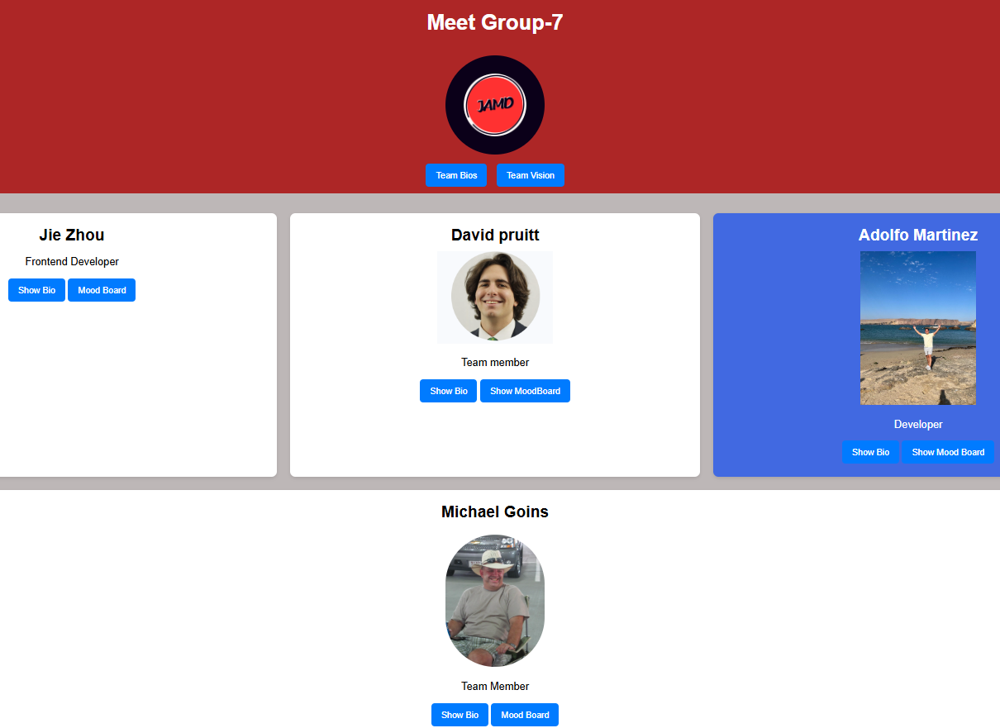

# ITSC-3155-051 Group-7 Final Project Repository (ITSC3155051Group7Project)

This GitHub Repository is currently shared (Collaborators) with:

	Group 7 Members:
		Adolfo Martinex (amart268@charlotte.edu), GitHub = adolfo117144
		David Pruitt (Dpruitt5@charlotte.edu), GitHub = ???
		Jie Zhou (Zzhou9@charlotte.edu), GitHub = zhouj870, and
		Michael Goins (mogoins@charlotte.edu), GitHub = mogonc34 (Repo originator)
	and the ITSC-3155-051 Professor & TA's:
		(primary) TA - Hari Priya Chinnala (hchinnal@charlotte.edu), GitHub = Hpchinala57
		(secondary) TA - Nicole Wiktor (nwiktor@charlotte.edu), GitHub = NicoleWiktor
		(secondary) TA - Hitakshi Shirude (hshirud1@charlotte.edu), GitHub = Hitaskhi02
		Professor - Dr. Mohsen Dorodchi (Mohsen.Dorodchi@charlotte.edu), GitHub = mdorodch

### Group Bio Page

Project Description:
This is a group project to build an Online Restaurant Ordering System (OROS) using Agile methodology.  OROS will develop a (RESTful)
API-based application using FastAPI, MySQL, and SQLAlchemy that enables customers to order menu items online, provide them a status
of order fulfillment while providing restaurant staff with tools to manage menus, orders, promotions, and analytics - all using
Swagger UI for demonstration, no front-end development is required.  The project will be developed in 2 (2-week) sprints.

We build endpoints for all CRUD activities - creating, reading, updating, and deleting records in the database. The API is secured
The API is built using the FastAPI framework, and the database is managed using SQLAlchemy and the PyMySQL library. The API
is tested using the Pytest framework and the HTTPX library for making HTTP requests. The API is designed to be easy to use and understand,
with clear documentation and error handling to help developers work with the API effectively.

The API application addresses Restaurant Owner goals to increase revenue by tapping into the online food ordering market trends with a
conventional platform; enhancing customer experience by...; leveraging customer feedback and data analytics, using data collected via the applications,
to improve restaurant operational efficiencies; use the platform to introduce enhance revenue generation through marketing promotions; and set
foundation for future enhancements to the platform.
Features include:
	1. 
	2.
	3.
	4.

March 25, 2025: all Commits to this repository should adhere to the Conventional Commits 1.0.0 specification,
as outlined at https://www.conventionalcommits.org/en/v1.0.0/ and summarized below:

with the commit containing the following structural elements, to communicate intent to the consumers of your library:

	1. build: Changes that affect the build system or external dependencies (e.g., updating scope(s): gulp, broccoli, npm)
	2. fix: a commit of the type fix patches a bug in your codebase (this correlates with PATCH in Semantic Versioning).
	3. feat: a commit of the type feat introduces a new feature to the codebase (this correlates with MINOR in Semantic Versioning).
	4. docs: Documentation-only changes (e.g., updating README file(s)).
	5. style: Changes that do not affect the meaning of the code (e.g., formatting, white-space, missing semi-colons, etc).
	6. refactor: Code change that neither fixes a bug nor adds a feature (e.g., restructuring code for better readability).
	7. perf: A code change that improves performance.
	8. test: Adding, or updating/correcting existing, tests (e.g., unit tests or integration).
	9. BREAKING CHANGE: a commit that has a footer BREAKING CHANGE:, or appends a ! after the type/scope, introduces a 
	   breaking API change (correlating with MAJOR in Semantic Versioning). A BREAKING CHANGE can be part of commits of any type.
	10. other types: are allowed, for example @commitlint/config-conventional (based on the Angular convention)
		recommends chore:, ci:, and others.
	11. footers other than BREAKING CHANGE: <description> may be provided and follow a convention similar to git trailer format.

# below this line is the README.md from code skeleton

### Installing necessary packages:  
* `pip install fastapi`
* `pip install "uvicorn[standard]"`  
* `pip install sqlalchemy`  
* `pip install pymysql`
* `pip install pytest`
* `pip install pytest-mock`
* `pip install httpx`
* `pip install cryptography`
### Run the server:
`uvicorn api.main:app --reload`
### Test API by built-in docs:
[http://127.0.0.1:8000/docs](http://127.0.0.1:8000/docs)
