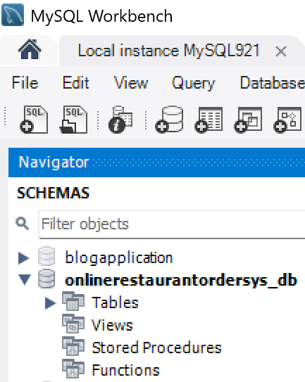
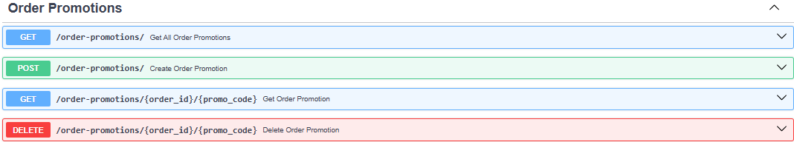

# JAMD-OROS API Technical Document

---

## Online Restaurant Ordering System (OROS)

### Team JAMD (Group 7)

| **Team Members**               | **GitHub Username** |
|--------------------------------|---------------------|
| Adolfo Martinez                | adolfo117144        |
| David Pruitt                   | Dpruitt5            |
| Jie Zhou                       | zhouj870            |
| Michael Goins                  | mogonc34            |

**Course:** ITSC-3155 Section 051 Final Project  
**Instructor:** Dr. Mohsen Dorodchi  
**Teaching Assistants:**  
- Hari Priya Chinnala (hchinnal@charlotte.edu)  
- Nicole Wiktor (nwiktor@charlotte.edu)  
- Hitakshi Shirude (hshirud1@charlotte.edu)  

**Submission Date:** May 2025  

---
## Final Project Technology Stack & Uses

[](https://github.com/mogonc34/ITSC3155051Group7Project)

---

## 1. Project Overview

This project designs, plans, and builds an Online Restaurant Ordering System (OROS), built using FastAPI, MySQL, 
and SQLAlchemy.  The solution provides a RESTful API for managing orders, customers, menu items, and more. The 
project uses SwaggerUI for API/database interaction and CRUD operation validation, eliminating the need for a 
frontend.  We use GitHub for version control and collaborative development.
The solution is near barebones, but it is a working solution satisfying requirements of the course project and 
built using Agile-Scrum framework - building a Product Back Log with (prioritized) User Stories, a Use Case 
Diagram, a Class Diagram, and an Activity Diagram (with Swim Lanes) to aid in overall design and work planning
leading to the final building of the coded solution.  The project is designed to be easy to use and understand,
with clear documentation and examples provided. 
The primary objective of the project being to design, analyze, and build a working solution for an Online 
Restaurant Ordering System (OROS) that demonstrates understanding of setup and use of a RESTful API, and execution
of database CRUD operations.

This Technical Document provides guidelines for setting up, configuring, and implementing the API-based database 
solution with User API-interactive CRUD operations executed using [Uvicorn](https://uvicorn.org) in conjunction with [SwaggerUI](https://swagger.io/tools/swagger-ui/).

---

### 1.1. Prerequisites / Assumptions
We have made some assumptions, presuming your knowledge as outlined here.  That you are:
	- familiar use of the IDE's command line interface (CLI) to run the project.
	- familiar with how to use a Python IDE to run and debug the project code. (Project Team had mixed use of PyCharm & Visual Studio Pro 2022)
	- familiar with how to use a web browser to access the SwaggerUI interface.
	- familiar with how to use the FastAPI framework to create and run a web application.
	- familiar with how to use a SQL database client to interact with the MySQL database.
	- familiar with how to use a testing framework to run unit tests.
	- familiar with how to use a version control system to manage the project code.
	- familiar with how to clone a GitHub repository and set up a local development environment.

## 1. Technology Stack & Uses
### 1.1. Development Tools
- 💾 [MySQL (Community) and MySQL Workbench](https://www.mysql.com) (or other SQL database client)
- 🐋 [PyCharm](https://www.jetbrains.com/pycharm/) (or other Python IDE)
- 📦 [GitHub](https://www.github.com) (or other version control system)
- 🚀 [SwaggerUI](https://swagger.io/tools/swagger-ui/) (or other API documentation tool)

### 1.2 Python Libraries
#### Core Libraries
- ⚡ [FastAPI](https://fastapi.tiangolo.com) - or other Python web framework
- [cryptography](https://pypi.org/project/cryptography/) - or other encryption library
- [HTTPX](https://www.python-httpx.org/) - or other HTTP client
- 🔍 [Pydantic](https://docs.pydantic.dev) - or other data validation library
- [PyMySQL](https://pypi.org/project/PyMySQL/) - or other MySQL driver
- [SQLAlchemy](https://www.sqlalchemy.org/) - or other ORM (Object Relational Mapper)
- 🧰 [SQLModel](https://sqlmodel.tiangolo.com) - or other SQL database interactions
#### Testing Tools
- [MagicMock](https://docs.python.org/3/library/unittest.mock.html) - or other mocking library
- ✅ [Pytest](https://pytest.org) (or other testing framework)
- [Uvicorn](https://uvicorn.org) (or other ASGI web server)

## 2. Project Setup
### 2.1. Clone the repository:
### 2.2 Open MySQL Workbench and create a new database named `onlinerestaurantordersys_db`.
```sql
CREATE DATABASE onlinerestaurantordersys_db;
USE onlinerestaurantordersys_db;
```
You should see the following in your MySQL Workbench SCHEMAS:

[](https://github.com/mogonc34/ITSC3155051Group7Project)

### 2.3 Install the required packages and create your virtual environment:
```bash
pip install -r requirements.txt
python -m venv .venv
```

### 2.4 Update files to point to and use your local database connection
#### 2.4.1 Update the SQLAlchemy database URL settings in the `main.py` file:
```python
SQLALCHEMY_DATABASE_URL = f"mysql+pymysql://{conf.db_user}:{quote_plus(conf.db_password)}@{conf.db_host}:{conf.db_port}/{conf.db_name}?charset=utf8mb4"
```
#### 2.4.2 Update the Conf Class in the 'config.py' file:
```python
    db_user = "yourlocalhostusername"  # Replace with your MySQL (localhost) user, i.e., root
    db_password = "yourlocalhostpassword"  # Replace with your MySQL (localhost) password
```
## 3. Run the Project
### 3.1. Activate the virtual environment:
```bash
source .venv/bin/activate
```

### 3.2. Start the FastAPI (Uvicorn) server:
```bash
uvicorn api.main:app --reload
```

### 3.3. Access the SwaggerUI interface:
[http://127.0.0.1:8000/docs](http://127.0.0.1:8000/docs)

### 4.3. Use the SwaggerUI interface to interact with the API:
- **GET**: Retrieve data from the API.
- **POST**: Create new records in the database.
- **PUT**: Update existing records in the database.
- **DELETE**: Remove records from the database.

### Key API Endpoints
 | Method | Endpoint           | Description                   |
 |--------|--------------------|-------------------------------|
 | GET    | /customers/        | Retrieve all customers        |
 | POST   | /customers/        | Create a new customer         |
 | GET    | /customers/{id}    | Retrieve a customer by ID     |
 | PUT    | /customers/{id}    | Update a customer by ID       |
 | DELETE | /customers/{id}    | Delete a customer by ID       |
 | GET    | /ingredients/      | Retrieve all ingredients      |
 | POST   | /ingredients/      | Create a new ingredient       |
 | GET    | /ingredients/{id}  | Retrieve an ingredient by ID  |
 | PUT    | /ingredients/{id}  | Update an ingredient by ID    |
 | DELETE | /ingredients/{id}  | Delete an ingredient by ID    |
 | GET    | /menu_items/       | Retrieve all menu items       |
 | POST   | /menu_items/       | Create a new menu item        |
 | GET    | /menu_items/{id}   | Retrieve a menu item by ID    |
 | PUT    | /menu_items/{id}   | Update a menu item by ID      |
 | DELETE | /menu_items/{id}   | Delete a menu item by ID      |

...each set of operations are repeated for Orders, Order Items, Order Promotions, Payments, Promotions, and Ratings-Reviews.

### Successfully API-interactive MySQL database structure, with Tables (SCHEMAS window)
[](https://github.com/mogonc34/ITSC3155051Group7Project)

### Successfully instantiated SwaggerUI browser page
[](https://github.com/mogonc34/ITSC3155051Group7Project)
[](https://github.com/mogonc34/ITSC3155051Group7Project)
[](https://github.com/mogonc34/ITSC3155051Group7Project)
[](https://github.com/mogonc34/ITSC3155051Group7Project)
[](https://github.com/mogonc34/ITSC3155051Group7Project)
[](https://github.com/mogonc34/ITSC3155051Group7Project)
[](https://github.com/mogonc34/ITSC3155051Group7Project)
[](https://github.com/mogonc34/ITSC3155051Group7Project)
[](https://github.com/mogonc34/ITSC3155051Group7Project)
[](https://github.com/mogonc34/ITSC3155051Group7Project)
