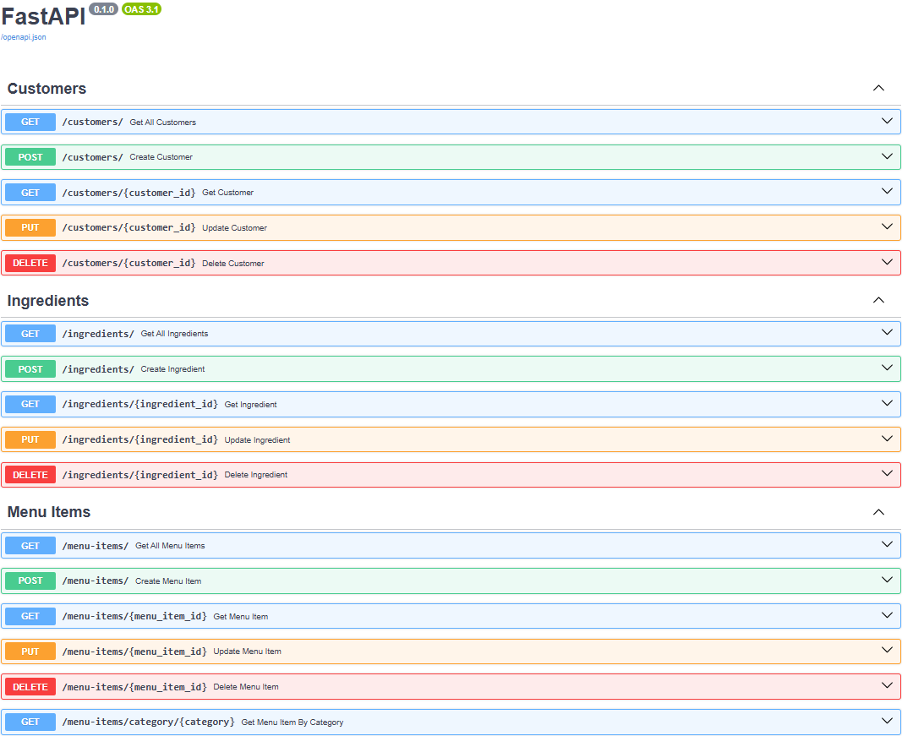
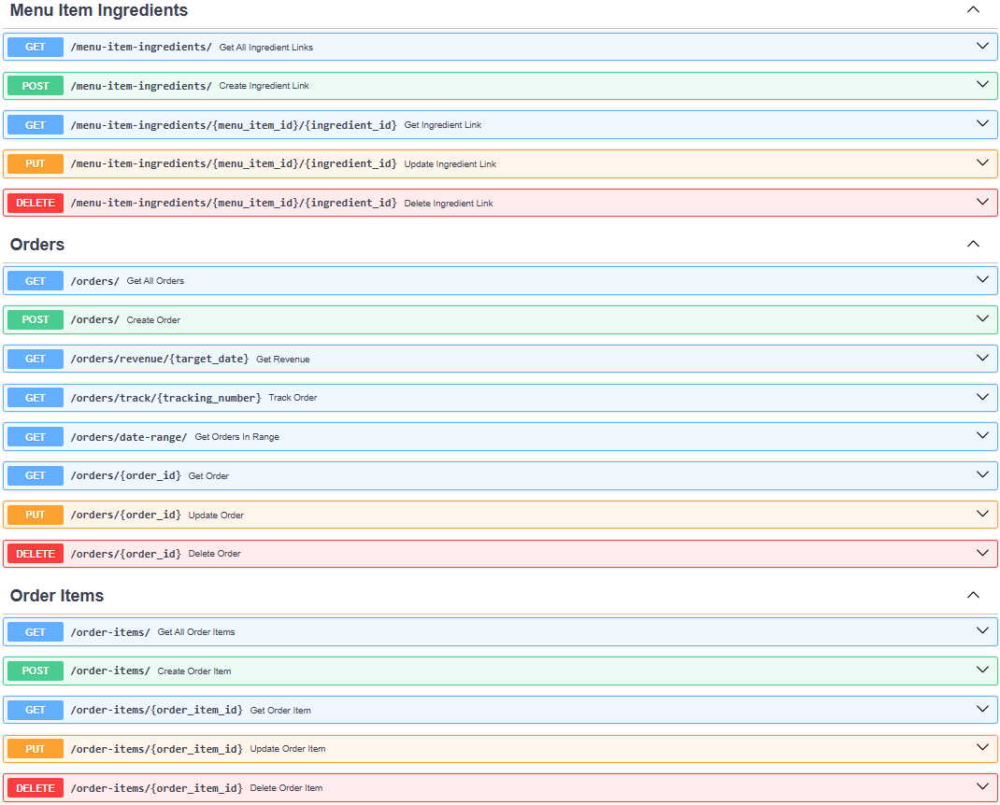
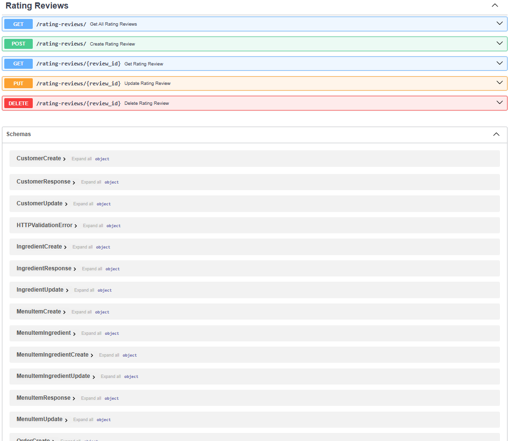

Copied this from FastAPI Project - Frontend

# ITSC-3155 Section-051 Group-7 Final Project User Manual

## 1. Introduction - Project Overview

The Online Restaurant Ordering System (OROS) is a RESTful API-based solution that provides a tool for streamlining a restaurant's
operations and enhance the customer ordering experience while also providing a platform for restaurant owners to manage their
menu items, orders, and promotions. The solution is built using FastAPI, MySQL, and SQLAlchemy, and is designed to be easy to use
and understand. The API implements features for managing orders, customers, menu items, and more. This solution uses a SwaggerUI, 
instead of a front-end UI, for User-interaction. The below User Manual is provided to help users to use the solution - whether 
they are a member the Restaurant Staff or an ordering Custumer. The solution is designed to be easy to use and understand, with 
clear documentation and examples provided.

### 1.1. Prerequisites / Assumptions
We have made some assumptions, presuming that the SwaggerUI is running for you already.  As such, you should see a long list of
categorized features, your web page should look like this:

If the SwaggerUI is not instantiated, you will need to refer to the Technical Document for steps to do do so, including implementing
the MySQL server as well.

From here, the User Manual is separated into two main sections (User Perspectives): Customer and Restaurant Staff.
Each section is further broken down into activities that can be performed by the user.

## 2. Customer
### 2.1. Account Actions
#### 2.1.1: To create an account, from the SwaggerUI menu, select Post /customers/ Create Customer to expand the option.

#### 2.1.2: Click Try It Out in the upper right (highlighted here:

#### 2.1.3: Enter the required information in the fields highlighted here.
**Reminder, make note of your Customer ID, as you will need this to validate or make any changes to your account (2.2).
Once you have entered the required information, click Execute.  The program will create a new customer record with the
information you've provided and assign a new Customer ID (make note of this as you will need it again).  A "Code 201, 
Successful Response" in the Responses section after you've clicked 'Execute' signals that your Customer Account has been 
created successfully.

### 2.2. Validate/View Your Customer Account
We'll go ahead and validate your account has been created & stored - click on the Post /customers/{customer_id} Get Customer option,
then click 'Try It Out' and enter your Customer ID in the field (highlighted) provided.  Click 'Execute' and you should see a 
"Code 200, Successful Response" in the Responses section.  Validate your Customer Information is as entered above.

Note: if you failed to capture your Customer ID in 2.1.2, you will need to contact the restaurant staff to get your Customer ID.
### 2.3. Update Account Information
Use the "Put /customers/{customer_id} Update Customer" option to update your account information.  Reminder, you will need to
provide your Customer ID to make updates.
### 2.4. Delete Your Account
To delete your account, use the "DELETE /customers/{customer_id} Delete Customer" option.  YOu will need your Customer ID to 
complete this action.

### 2.2. Customer: Order Actions
#### 2.2.1 Place an Order
To place an order, you will need to locate Menu Items > "Get /menu-items/ Get All Menu Items".  Expand the option, click
'Try It Out' and then 'Execute' to see the list of Menu Items available for order.  Once you have identified the items you 
want to order, you will need to then locate the Orders > "Post /orders/ Create Order" options.
#### 2.2.2. Check Order Status / View an Order
YOu can check the status of your order in a few ways.
#### 2.2.2.1: with Order ID
Go to Orders > "Get /orders/{order_id} Get Order" option and enter the Order ID.
#### 2.2.2.2: with Tracking Number
Go to Orders > "Get /orders/track/{tracking_number} Track order" and enter your Tracking Number.
#### 2.2.2.3: with Date
Go to Orders > "Get /orders/date-range/ Get Orders in Range" and enter the date of your order.

#### 2.2.3. Update/Revise an Order
To update/revise an order, locate Orders > "PUT /orders/{order_id} Update Order" option.  You will need to provide your Order ID.
#### 2.2.4: Cancel an Order
To cancel an order, you will need to access the "DELETE /orders/{order_id} Delete Order" function in the Orders section.  Expand
### 2.2.5. Browse Restaurant Menu
To view the restaurant's menu items, locate Menu Items > "GET /menu-items/ Get All Menu Items"

### 2.3. Customer: Rate and Review
#### 2.3.1: Rate a Menu Item
To provide a rating for a menu item, go to the Rating Reviews section > "POST /rating-reviews/ Create Rating Review" - you will
need your Customer ID, the Menu Item ID; then can enter your Review Text and (integer) Score.
#### 2.3.2: Update a Rating Review provided previously
To update a rating review, go to the Rating Reviews section > "PUT /rating-reviews/{rating_review_id} Update Rating Review" - you will
need the Review ID (from the previous Rating); then can enter your Review Text and (integer) Score.

## 3. Restaurant Staff
### 3.1. Menu Actions
#### 3.1.1 Create a Menu Item
To create a menu item, the restaurant staff must provide the item name, description, price, and category. The API will validate the input and create a new menu item record in the database.
#### 3.1.2. Update a Menu Item
To update a menu item, the restaurant staff must provide the item ID and the new information they wish to update. The API will validate the input and update the menu item record in the database.
#### 3.1.3. Delete a Menu Item
To delete a menu item, the restaurant staff must provide the item ID. The API will validate the input and delete the menu item record from the database.
#### 3.1.4. View All Menu Items
To view the menu items, the restaurant staff can make a GET request to the API. The API will retrieve the menu items from the database and return them to the restaurant staff.

### 3.2. Promotions
#### 3.2.1. Create a Promotion
To create a promotion, the restaurant staff must provide the promotion name, description, start date, end date, and discount percentage. The API will validate the input and create a new promotion record in the database.
#### 3.2.2. Update a Promotion
To update a promotion, the restaurant staff must provide the promotion ID and the new information they wish to update. The API will validate the input and update the promotion record in the database.
#### 3.2.3. Delete a Promotion
To delete a promotion, the restaurant staff must provide the promotion ID. The API will validate the input and delete the promotion record from the database.
#### 3.2.4. View All Promotions
To view the promotions, the restaurant staff can make a GET request to the API. The API will retrieve the promotions from the database and return them to the restaurant staff.

### 3.3. Order Actions
#### 3.3.1. View All Orders
To view the orders, locate Orders > "GET /orders/ Get All Orders".
#### 3.3.2. Review Revenue from OROS Orders (on a specific date)
To review the revenue from OROS orders, locate Orders > "GET /orders/revenue/{target_date} Get Revenue}"
#### 3.3.2. Update an Order
To update an order - i.e. to update its status or tracking information - locate Orders > "PUT /orders/{order_id} Update Order"
#### 3.3.3. Delete an Order
To delete an order, the restaurant staff must provide the order ID. The API will validate the input and delete the order record from the database.
#### 3.3.4. Create an Order
To create an order, the restaurant staff must provide the customer ID, menu items, and payment information. The API will validate the input and create a new order record in the database.

### 3.6. Updating a Promotion
To update a promotion, the restaurant staff must provide the promotion ID and the new information they wish to update. The API will validate the input and update the promotion record in the database.
### 3.7. Deleting a Promotion
To delete a promotion, the restaurant staff must provide the promotion ID. The API will validate the input and delete the promotion record from the database.
### 3.8. Viewing Promotions
To view the promotions, the restaurant staff can make a GET request to the API. The API will retrieve the promotions from the database and return them to the restaurant staff.
### 3.9. Viewing Order History
To view the order history, the restaurant staff can make a GET request to the API. The API will retrieve the order history from the database and return it to the restaurant staff.
### 3.10. Viewing Customer Information
To view customer information, the restaurant staff can make a GET request to the API. The API will retrieve the customer information from the database and return it to the restaurant staff.
### 3.11. Viewing Order Details
To view the details of an order, the restaurant staff must provide the order ID. The API will retrieve the order details from the database and return them to the restaurant staff.
### 3.12. Updating Order Information
To update order information, the restaurant staff must provide the order ID and the new information they wish to update. The API will validate the input and update the order record in the database.
### 3.13. Deleting an Order
To delete an order, the restaurant staff must provide the order ID. The API will validate the input and delete the order record from the database.
### 3.14. Viewing Order Status
To view the status of an order, the restaurant staff must provide the order ID. The API will retrieve the order status from the database and return it to the restaurant staff.
### 3.15. Viewing Customer Orders
To view the orders of a customer, the restaurant staff must provide the customer ID. The API will retrieve the customer orders from the database and return them to the restaurant staff.
### 3.16. Viewing Customer Ratings and Reviews
To view the ratings and reviews of a customer, the restaurant staff must provide the customer ID. The API will retrieve the customer ratings and reviews from the database and return them to the restaurant staff.
### 3.17. Viewing Customer Feedback
To view the feedback of a customer, the restaurant staff must provide the customer ID. The API will retrieve the customer feedback from the database and return it to the restaurant staff.
### 3.18. Viewing Customer Order History
To view the order history of a customer, the restaurant staff must provide the customer ID. The API will retrieve the customer order history from the database and return it to the restaurant staff.
### 3.19. Viewing Customer Order Details
To view the details of a customer's order, the restaurant staff must provide the customer ID and the order ID. The API will retrieve the customer order details from the database and return them to the restaurant staff.
### 3.20. Viewing Customer Order Status
To view the status of a customer's order, the restaurant staff must provide the customer ID and the order ID. The API will retrieve the customer order status from the database and return it to the restaurant staff.
### 3.21. Viewing Customer Order Promotions
To view the promotions applied to a customer's order, the restaurant staff must provide the customer ID and the order ID. The API will retrieve the customer order promotions from the database and return them to the restaurant staff.
### 3.22. Viewing Customer Order Payments
To view the payments made by a customer for an order, the restaurant staff must provide the customer ID and the order ID. The API will retrieve the customer order payments from the database and return them to the restaurant staff.
### 3.23. Viewing Customer Order Ratings and Reviews
To view the ratings and reviews given by a customer for an order, the restaurant staff must provide the customer ID and the order ID. The API will retrieve the customer order ratings and reviews from the database and return them to the restaurant staff.
### 3.24. Viewing Customer Order Feedback
To view the feedback given by a customer for an order, the restaurant staff must provide the customer ID and the order ID. The API will retrieve the customer order feedback from the database and return it to the restaurant staff.
### 3.25. Viewing Customer Order History
To view the order history of a customer, the restaurant staff must provide the customer ID. The API will retrieve the customer order history from the database and return it to the restaurant staff.
### 3.26. Viewing Customer Order Details
To view the details of a customer's order, the restaurant staff must provide the customer ID and the order ID. The API will retrieve the customer order details from the database and return them to the restaurant staff.
### 3.27. Viewing Customer Order Status
To view the status of a customer's order, the restaurant staff must provide the customer ID and the order ID. The API will retrieve the customer order status from the database and return it to the restaurant staff.
### 3.28. Viewing Customer Order Promotions
To view the promotions applied to a customer's order, the restaurant staff must provide the customer ID and the order ID. The API will retrieve the customer order promotions from the database and return them to the restaurant staff.
### 3.29. Viewing Customer Order Payments
To view the payments made by a customer for an order, the restaurant staff must provide the customer ID and the order ID. The API will retrieve the customer order payments from the database and return them to the restaurant staff.
### 3.30. Viewing Customer Order Ratings and Reviews
To view the ratings and reviews given by a customer for an order, the restaurant staff must provide the customer ID and the order ID. The API will retrieve the customer order ratings and reviews from the database and return them to the restaurant staff.
### 3.31. Viewing Customer Order Feedback
To view the feedback given by a customer for an order, the restaurant staff must provide the customer ID and the order ID. The API will retrieve the customer order feedback from the database and return it to the restaurant staff.

If not, refer to the Technical Document for troubleshooting steps which walks you thru the process of setting up the project,
to get the SwaggerUI to work.  The Technical Document also provides a detailed overview of the project, including the technology stack used,
the database schema, and the API endpoints.

