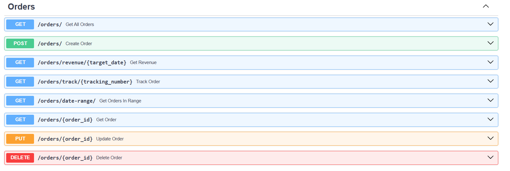

# ITSC-3155 Section-051 Group-7 Final Project User Manual

## 1. Introduction - Project Overview

The Online Restaurant Ordering System (OROS) is a RESTful API-based solution for restaurants to expand their customer base to those
who prefer to use an online tool for ordering.  The solution also provides restaurant ownership/management a tool for streamlining
their improving their operations and enhance the customer ordering experience while also digitizing their menus and enabling 
customer feedback. The API implements features for managing orders, customers, menu items, and more. This solution uses a SwaggerUI, 
instead of a front-end UI, for User-interaction

The below User Manual is provided to guide users through the features from both perspectives - whether as a member the Restaurant 
Staff or an ordering Custumer.

### 1.1. Prerequisites / Assumptions
We have made some assumptions, presuming that the SwaggerUI is running for you already.  As such, you should see a long list of
categorized features, your web page should look like this:

If the SwaggerUI is not instantiated, you will need to refer to the Technical Document for steps to do do so, including implementing
the MySQL server as well.

From here, the User Manual is separated into two main sections (User Perspectives): Customer and Restaurant Staff.
Each section is further broken down into activities that can be performed by the user.

## 2. Customer
### 2.1. Account Actions
#### 2.1.1: To create an account, from the SwaggerUI menu, select Post /customers/ Create Customer to expand the option.

#### 2.1.2: Click Try It Out in the upper right (highlighted here:

#### 2.1.3: Enter the required information in the fields highlighted here.
**Reminder, make note of your Customer ID, as you will need this to validate or make any changes to your account (2.2).
Once you have entered the required information, click Execute.  The program will create a new customer record with the
information you've provided and assign a new Customer ID (make note of this as you will need it again).  A "Code 201, 
Successful Response" in the Responses section after you've clicked 'Execute' signals that your Customer Account has been 
created successfully.

### 2.2. Validate/View Your Customer Account
We'll go ahead and validate your account has been created & stored - click on the Post /customers/{customer_id} Get Customer option,
then click 'Try It Out' and enter your Customer ID in the field (highlighted) provided.  Click 'Execute' and you should see a 
"Code 200, Successful Response" in the Responses section.  Validate your Customer Information is as entered above.

Note: if you failed to capture your Customer ID in 2.1.2, you will need to contact the restaurant staff to get your Customer ID.
### 2.3. Update Account Information
Use the "Put /customers/{customer_id} Update Customer" option to update your account information.  Reminder, you will need to
provide your Customer ID to make updates.
### 2.4. Delete Your Account
To delete your account, use the "DELETE /customers/{customer_id} Delete Customer" option.  YOu will need your Customer ID to 
complete this action.

### 2.2. Customer: Order Actions
#### 2.2.1 Place an Order
To place an order, you will need to locate Menu Items > "Get /menu-items/ Get All Menu Items".  Expand the option, click
'Try It Out' and then 'Execute' to see the list of Menu Items available for order.  Once you have identified the items you 
want to order, you will need to then locate the Orders > "Post /orders/ Create Order" options.
#### 2.2.2. Check Order Status / View an Order
YOu can check the status of your order in a few ways.
#### 2.2.2.1: with Order ID
Go to Orders > "Get /orders/{order_id} Get Order" option and enter the Order ID.
#### 2.2.2.2: with Tracking Number
Go to Orders > "Get /orders/track/{tracking_number} Track order" and enter your Tracking Number.
#### 2.2.2.3: with Date
Go to Orders > "Get /orders/date-range/ Get Orders in Range" and enter the date of your order.

#### 2.2.3. Update/Revise an Order
To update/revise an order, locate Orders > "PUT /orders/{order_id} Update Order" option.  You will need to provide your Order ID.
#### 2.2.4: Cancel an Order
To cancel an order, you will need to access the "DELETE /orders/{order_id} Delete Order" function in the Orders section.  Expand
### 2.2.5. Browse Restaurant Menu
To view the restaurant's menu items, locate Menu Items > "GET /menu-items/ Get All Menu Items"

### 2.3. Customer: Rate and Review
#### 2.3.1: Rate a Menu Item
To provide a rating for a menu item, go to the Rating Reviews section > "POST /rating-reviews/ Create Rating Review" - you will
need your Customer ID, the Menu Item ID; then can enter your Review Text and (integer) Score.
#### 2.3.2: Update a Rating Review provided previously
To update a rating review, go to the Rating Reviews section > "PUT /rating-reviews/{rating_review_id} Update Rating Review" - you will
need the Review ID (from the previous Rating); then can enter your Review Text and (integer) Score.

## 3. Restaurant Staff
At present, Restaurant Staff/Management will use the same SwaggerUI as a Customer - future enhancements will address separation and controls
to separate by role.  The mechanics for executing the below functions, are very similar to that of the Customer > Account Actions section (above) 
so will avoid the redundant language here.  Those mechanics being to locate the referenced function, expand the block, click "Try It Out", 
update the required information (right side of the colon, between the ""), click "Execute" and look for Successful Response to confirm actionw
as completed.

### 3.1. Staff: Menu Actions
#### 3.1.1 Create a Menu Item
To create a Menu Item, you will first need to ensure the needed ingredients are created for selection - "POST /ingredients/ Create ingredient".
With the Ingredient ID and the known quantity needed, you can proceed to create the needed association to a Menu Item using the Menu Item 
Ingredients > "POST /menu-items/ Create Menu Item".  With those two elements in place, you can then create the Menu Item itself using the
"POST /menu-items/ Create Menu Item" function.  You will need to provide the following information: Name, Description, Price, Calories,
and Food Category.
#### 3.1.2. Update a Menu Item
To update a menu item, you'll need it's Menu Item ID - if you are unsure of the ID, refer to 3.1.4 to View All Menu Items to see the full list 
of Menu Items currently available for ordering.  With the Menu Item ID(s), go to Menu Items > "PUT /menu-items/{item_id} Update Menu Item".  
Enter the Menu Item ID, click Execute, update the information you want to change, and click Execute again.
#### 3.1.3. Delete a Menu Item
To delete a menu item, with the Menu Item ID, locate Menu Items > "DELETE /menu-items/{item_id} Delete Menu Item", "Try It Out", provide the 
Menu Item ID, and click Execute.
#### 3.1.4. View All Menu Items
To view the menu items, locate Menu Items > "GET /menu-items/ Get All Menu Items".
#### 3.1.5. View Menu Items by Category
You can also view all menu items by category - to do so, locate Menu Items > "GET /menu-items/category/{category} Get Menu Items by Category" and enter the
category you want to view.  The system will return all menu items in that category.  If you are unsure of the category, you can view the available
categories by viewing all Menu Items, 3.1.4 (above).

### 3.2. Staff: Promotions
#### 3.2.1. Create a Promotion
To create a promotion, locate Promotions > "POST /promotions/ Create Promotion".  Have the promotion name, description, start date, end date, and discount percentage.
#### 3.2.2. Update a Promotion
To update a promotion, the restaurant staff must provide the promotion ID and the new information they wish to update. The API will validate the input and update the promotion record in the database.
#### 3.2.3. Delete a Promotion
To delete a promotion, locate Promotions > "DELETE /promotions/{promo_code}" - you will need the promotion ID.
#### 3.2.4. View All Promotions
To view existing promotions, locate Promotions > "GET /promotions/ Get All Promotions".

### 3.3. Staff: Order Actions
#### 3.3.1. View All Orders
To view the orders, locate Orders > "GET /orders/ Get All Orders".
#### 3.3.2. Review Revenue from OROS Orders (on a specific date)
To review revenue from OROS orders for a date, locate Orders > "GET /orders/revenue/{target_date} Get Revenue}"
#### 3.3.2. Update an Order
To update an order - i.e. to update its status or tracking information - locate Orders > "PUT /orders/{order_id} Update Order"
#### 3.3.3. Delete an Order
To delete an order, the restaurant staff must provide the order ID.
#### 3.3.4. Create an Order
To create an order, locate Orders > "POST /orders/ Create Order".
